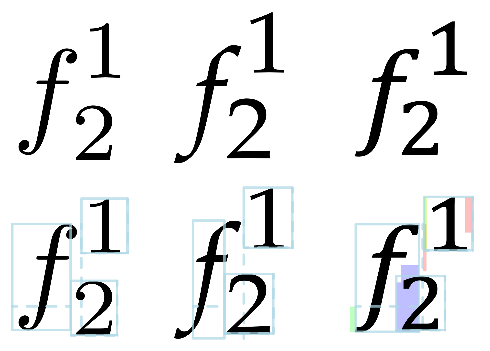

# blackboard

This is a (very) unfinished implementation of an [OpenType Math][ot:math] layout and rendering engine in Racket.

It is almost certainly not directly useful to anyone at the moment, because it is essentially impossible for anyone other than its author to build and run it due to dependencies on upstream patches. In particular, it requires:

  * [HarfBuzz][harfbuzz] >=3.4.0, which includes [harfbuzz#3416](https://github.com/harfbuzz/harfbuzz/pull/3416)

  * some minor changes to `racket/draw` to expose some additional (unsafe) functionality, which are currently not publicly available anywhere (though I could push them if someone is really interested)

  * patched versions of OpenType math fonts to remove the dependency on the OpenType `math` script for proper shaping (see `fonts/eliminate-math-script.py` for more details)

Even if one were to go to the hassle of setting up all the necessary dependencies, the system is currently too unfinished to be of any practical use. However, I have decided to make the source code publicly available on the off chance that someone might find it interesting.

[harfbuzz]: https://github.com/harfbuzz/harfbuzz
[ot:math]: https://docs.microsoft.com/en-us/typography/opentype/spec/math
